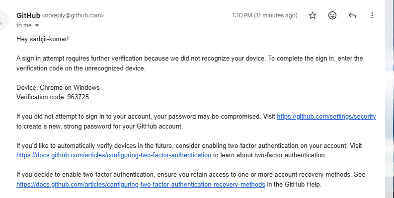

# 🖥️ Active Directory Setup (AD DS)

## 📌 Overview
Active Directory Domain Services (AD DS) is used to manage users, computers, and resources in a centralized network environment.

---

## ⚙️ What I Implemented
- Installed AD DS on Windows Server
- Promoted server to Domain Controller
- Created domain: **SYNC.LOCAL**
- Designed OU structure (IT, HR, Operations)
- Created users and security groups
- Joined Windows 10 client to domain

---

## 🧠 Key Concepts
- Centralized identity management
- Organizational Units (OUs) for structure
- Group-based access control
- Domain-based authentication

---

## ✅ Validation
- Client successfully joined to domain
- Users and groups visible in ADUC
- Domain login working correctly

---
## 📸 Screenshots

![AD Setup] ./test1.png

## 💼 Real-World Relevance
This setup reflects how enterprise environments manage users, permissions, and systems centrally using Active Directory.
